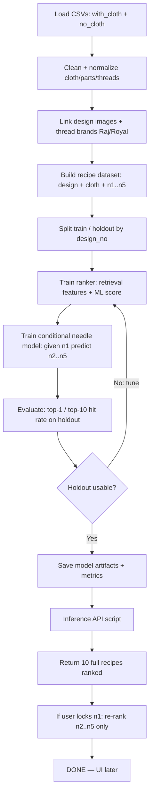

# Jeetubhai Thread Colour Model — Process Map

## Stages (execute in order — no user prompts)

1. **Data** — load CSVs, drop empty-needle rows, normalize, keep jari in fields but exclude from v1 scoring targets when brand is Jari.
2. **Features** — cloth, parts/design_type, design_no, thread_count, has_tikli.
3. **Core model** — hybrid:
   - Stage A: retrieve historical recipes (exact design+cloth → same design → same parts+cloth → cloth-only).
   - Stage B: score/rank candidates with a learned model.
   - Stage C: conditional refresh for needles 2–5 when n1 is locked.
4. **Eval** — top-1 and top-10 full-recipe match on held-out designs.
5. **Ship** — `models/` artifacts + `predict.py` CLI that prints 10 recipes.
6. **Stop** — working model ready; UI is out of scope until user returns.

## Status: COMPLETE

- Trained on 2210 recipes from CSVs
- Artifact: `models/colour_recommender.joblib`
- CLI: `python scripts/predict.py --cloth ... --design ...`
- Returns up to 10 full recipes; supports `--lock-n1` to refresh needles 2–5 only
